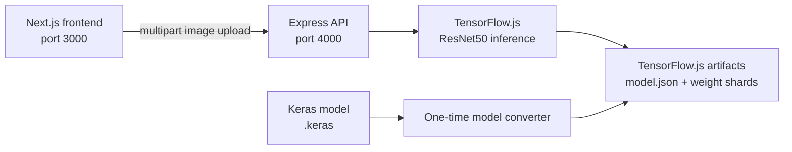

# Noseprint — Dog Emotion Classifier

Noseprint is a full-stack image classifier that estimates a dog's visible
expression from a photo. It returns one of four labels—`angry`, `happy`,
`relaxed`, or `sad`—together with confidence scores for every class.

The project combines a Next.js interface, an Express API, and a fine-tuned
ResNet50 model. Docker Compose handles model conversion, service startup order,
and health checks.

> Noseprint is an experimental image classifier, not a veterinary diagnostic
> tool. Its output should not be used as a substitute for professional advice.

## Features

- Drag-and-drop dog photo upload with an immediate preview
- Four-class prediction with confidence and per-class probabilities
- JPEG, PNG, WebP, BMP, and GIF support up to a configurable size limit
- Native TensorFlow inference through `@tensorflow/tfjs-node`
- Automatic Keras-to-TensorFlow.js conversion on the first Docker run
- Production-oriented, non-root frontend and backend containers
- Health checks and dependency-aware Docker Compose startup

## Architecture



The browser calls the API directly. The API resizes and applies ResNet50
preprocessing to the uploaded image, loads the converted model, and returns a
ranked probability list. Uploaded images are held in memory for the request and
are not persisted by the application.

## Technology

| Area | Stack |
| --- | --- |
| Frontend | Next.js 16, React 19, TypeScript, CSS Modules |
| API | Node.js, Express, Multer, Helmet, CORS |
| Inference | TensorFlow.js Node 4.22 |
| Training | TensorFlow/Keras, ResNet50 transfer learning |
| Runtime | Docker, Docker Compose |

## Quick start with Docker

### Prerequisites

- Docker Desktop or Docker Engine
- Docker Compose v2 (`docker compose`)
- At least several gigabytes of free disk space for the initial TensorFlow
  converter image and model artifacts

The source model must exist at:

```text
ml-training/saved_models/dog_emotion_resnet50.keras
```

### Start the application

From the repository root:

```bash
docker compose up --build
```

The first run builds a TensorFlow conversion image and converts the Keras model.
This can take several minutes. Generated files are stored in
`ml-training/saved_models/tfjs/`; subsequent starts detect them and skip the
conversion.

Once the services are healthy, open:

- Application: <http://localhost:3000>
- API health: <http://localhost:4000/api/health>

A ready backend returns:

```json
{"status":"ok","model":"ready"}
```

Start the existing images in the background on later runs:

```bash
docker compose up -d
```

Useful Docker commands:

```bash
# Show service state and health
docker compose ps

# Follow application logs
docker compose logs -f frontend backend

# Stop and remove the containers and Compose network
docker compose down
```

## Configuration

Docker Compose works without an environment file. To customize it, copy
`.env.docker.example` to `.env` in the repository root and edit the values:

| Variable | Default | Purpose |
| --- | --- | --- |
| `FRONTEND_PORT` | `3000` | Frontend port exposed on the host |
| `BACKEND_PORT` | `4000` | API port exposed on the host |
| `FRONTEND_ORIGIN` | `http://localhost:3000` | Origin allowed by the API's CORS policy |
| `NEXT_PUBLIC_API_URL` | `http://localhost:4000` | Browser-visible API base URL |
| `MAX_IMAGE_SIZE_MB` | `10` | Maximum uploaded image size |

`NEXT_PUBLIC_API_URL` is embedded in the frontend bundle during the image
build. Rebuild after changing it:

```bash
docker compose up -d --build frontend
```

When exposing the application through another hostname, update both
`FRONTEND_ORIGIN` and `NEXT_PUBLIC_API_URL` to URLs reachable by the user's
browser—not Docker service names such as `backend`.

## Run locally without Docker

Docker is still required once to produce the TensorFlow.js model automatically,
or the model must be converted manually. Confirm that
`ml-training/saved_models/tfjs/model.json` exists before starting the API.

### Backend

```bash
cd backend
npm ci
```

Copy `backend/.env.example` to `backend/.env`, then run:

```bash
npm run dev
```

The API starts at <http://localhost:4000>.

### Frontend

In a second terminal:

```bash
cd frontend
npm ci
```

Copy `frontend/.env.example` to `frontend/.env.local`, then run:

```bash
npm run dev
```

The frontend starts at <http://localhost:3000>.

## API

### Health check

```http
GET /api/health
```

The endpoint reports both process and model-loading state. It returns HTTP 503
when model loading has failed.

### Predict an expression

```http
POST /api/predict
Content-Type: multipart/form-data
```

Send the image in a form field named `image`:

```bash
curl -X POST http://localhost:4000/api/predict \
  -F "image=@dog.jpg"
```

Example response:

```json
{
  "prediction": "happy",
  "confidence": 0.91,
  "probabilities": [
    { "label": "happy", "probability": 0.91 },
    { "label": "relaxed", "probability": 0.05 },
    { "label": "sad", "probability": 0.03 },
    { "label": "angry", "probability": 0.01 }
  ]
}
```

The class index order is `angry`, `happy`, `relaxed`, `sad`, matching the
alphabetical directory order used during training.

## Model workflow

The training pipeline in `ml-training/training.py` uses a pretrained ResNet50
without its original classification head, followed by global average pooling
and a four-unit softmax layer. It trains on 224 × 224 images and uses an 80/20
training-validation split with early stopping.

Expected dataset structure:

```text
data/
├── angry/
├── happy/
├── relaxed/
└── sad/
```

The current training script expects the dataset at `/data`. Adjust that path or
mount the dataset there before retraining. Training produces a Keras model under
`ml-training/saved_models/`.

The Compose `model-converter` service performs two compatibility steps:

1. It loads the Keras 3 model and transfers the trained weights into a legacy
   Keras ResNet50 topology supported by TensorFlow.js.
2. It converts that deployment model into `model.json` and binary weight shards.

ResNet50's RGB-to-BGR conversion and channel mean subtraction are performed by
the API before inference. The converted files are mounted read-only into the API
container and excluded from Git.

After replacing or retraining the source model, remove the generated files under
`ml-training/saved_models/tfjs/` and run:

```bash
docker compose up --build
```

## Project structure

```text
.
├── backend/                  Express API and TensorFlow.js inference
│   ├── src/
│   ├── test/
│   └── Dockerfile
├── frontend/                 Next.js user interface
│   ├── public/
│   ├── src/app/
│   └── Dockerfile
├── ml-training/              Training and model-conversion tooling
│   ├── notebooks/
│   ├── saved_models/
│   ├── training.py
│   └── Dockerfile.converter
├── docker-compose.yml
└── .env.docker.example
```

## Tests and checks

Run the backend API tests:

```bash
cd backend
npm test
```

Run frontend linting and a production build:

```bash
cd frontend
npm run lint
npm run build
```

Validate the Compose configuration:

```bash
docker compose config --quiet
```

## Troubleshooting

### The initial build takes a long time

The converter downloads TensorFlow and supporting Python packages. This is
expected on the first build; Docker caches the image and converted model for
later runs.

### `TensorFlow.js model not found`

Check the converter logs and confirm that `model.json` and `.bin` files exist in
`ml-training/saved_models/tfjs/`:

```bash
docker compose logs model-converter
```

Then rebuild and start the stack:

```bash
docker compose up --build
```

### The backend is unhealthy

Inspect its model-loading message:

```bash
docker compose logs backend
```

Also verify the health response at <http://localhost:4000/api/health>.

### The browser cannot reach the API

Make sure `NEXT_PUBLIC_API_URL` is reachable from the browser and that
`FRONTEND_ORIGIN` exactly matches the frontend's public origin. Rebuild the
frontend after changing either public URL.
